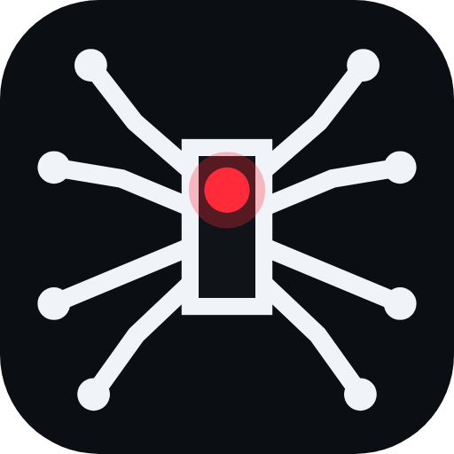
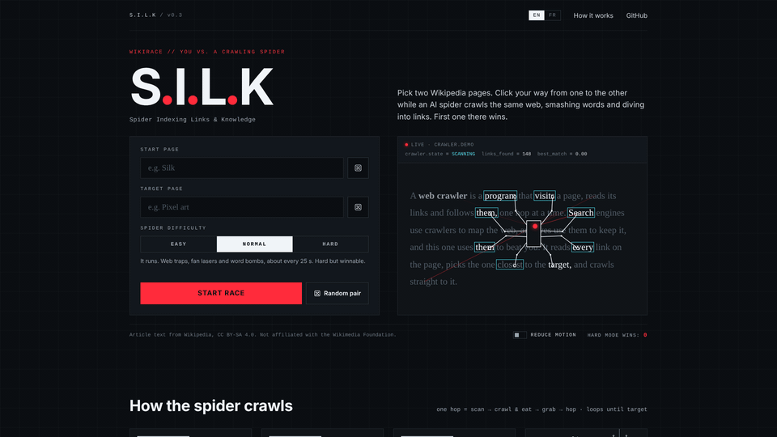
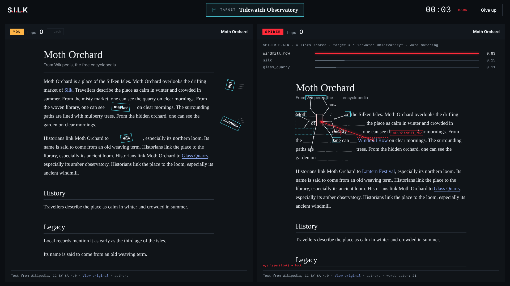
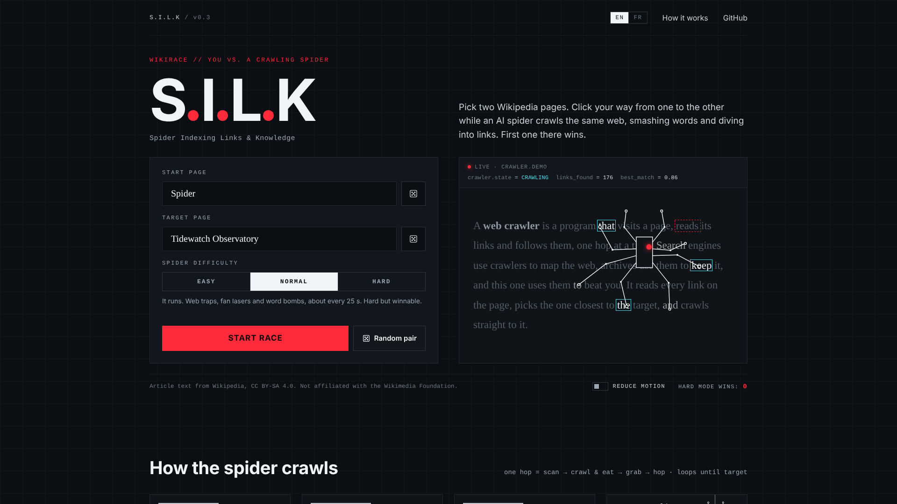
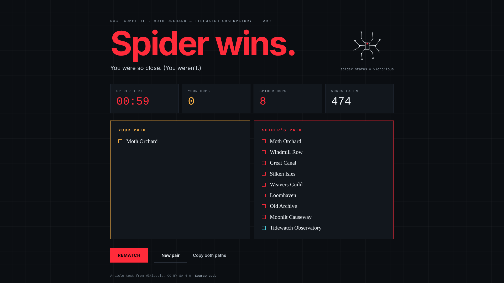
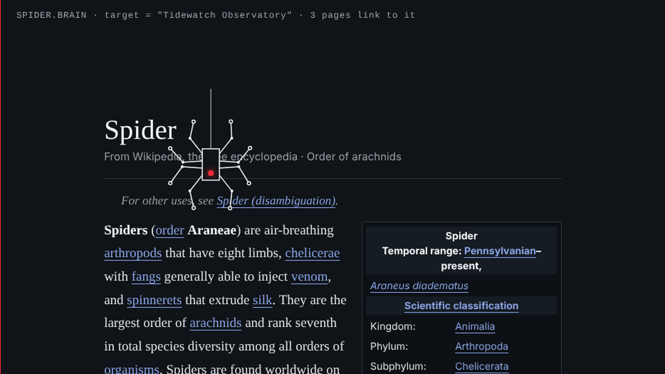
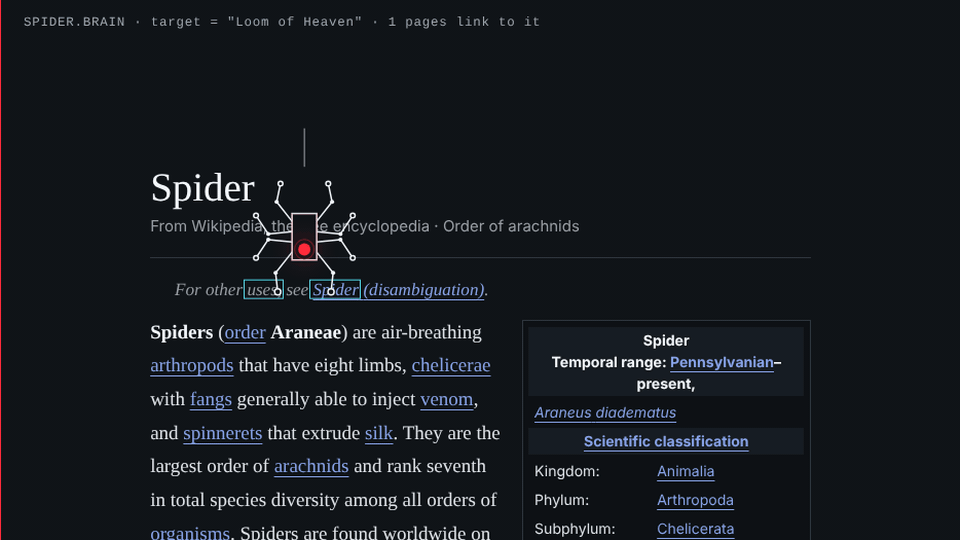
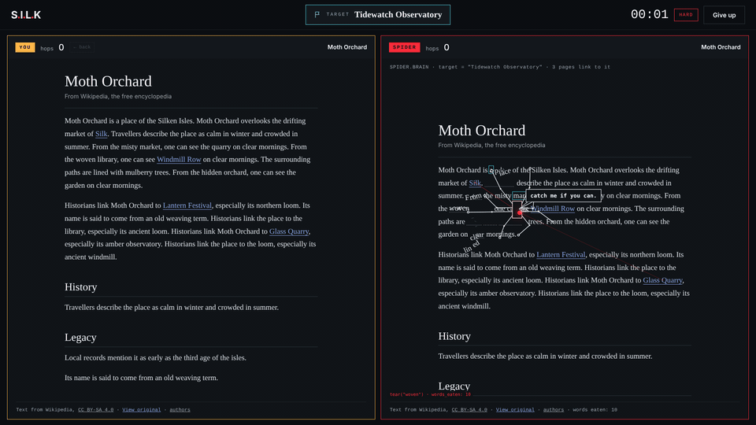
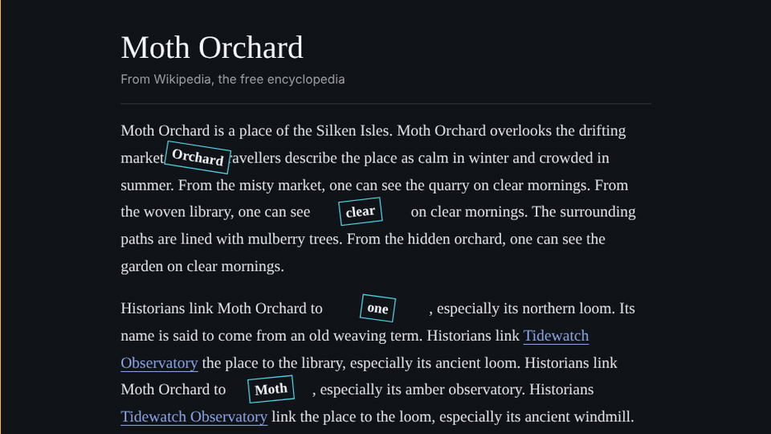
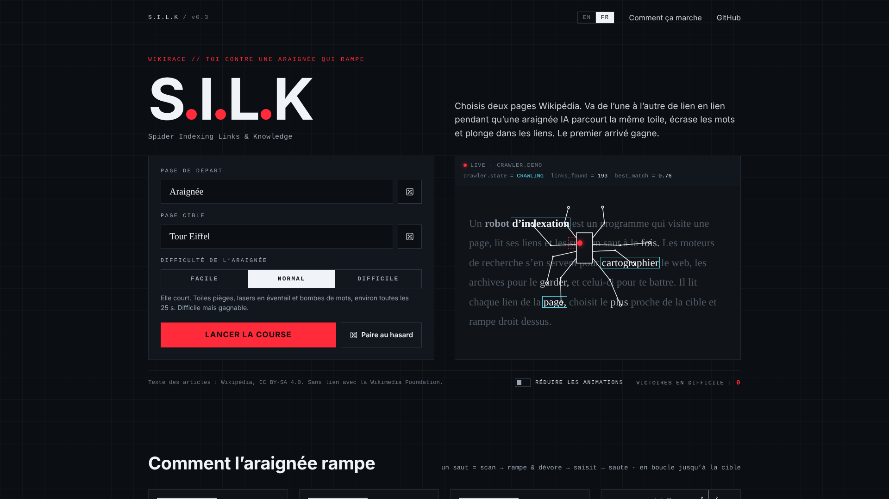

<div align="center">



# S.I.L.K

### Spider Indexing Links & Knowledge

A Wikirace against an AI spider that ranks every link with a language model in your browser, walks over the words to the best one, and wrecks your page on the way.

[](https://www.typescriptlang.org)
[](https://vite.dev)
[](https://developer.mozilla.org/en-US/docs/Web/API/Canvas_API)
[](https://github.com/huggingface/transformers.js)
[](https://www.wikipedia.org)
[](#-testing)
[](https://huang-frederic.github.io/S.I.L.K/)

[The race](#-two-pages-one-race) · [The brain](#-it-reads-every-link) · [The walk](#-it-has-to-walk-there) · [The attacks](#-it-fights-back) · [Two languages](#-one-switch-two-wikipedias) · [Under the hood](#-under-the-hood) · [What I learned](#-what-i-learned) · [Demo](#-see-it-in-action) · [Quick start](#-try-it-yourself)

</div>

---

## A web crawler, but literal

Wikiracing is an old internet game. Two players open the same Wikipedia article and race to another one, clicking only the links in the text. *Spider* to *Eiffel Tower*: go. You skim, you guess, you click, and the first one there wins.

Programs that walk the web link by link are called crawlers, or spiders, and I couldn't stop picturing that word literally: an opponent you can watch read the page, pick a link, crawl over the text to reach it and eat the words on its way. Smart enough to be a real rival, and petty enough to set your page on fire when you get close.

That's why I built **S.I.L.K** — *Spider Indexing Links & Knowledge*. Solo, in one day of short feedback rounds (ten pull requests), with Claude Code as my pair programmer. It runs entirely in the browser, on live Wikipedia, in English and in French.

---

## 🎬 See it in action

A whole race on Hard, condensed: two pages, the countdown, the spider's first moves and first hop, then its victory dance.

<p align="center">
  
  <br /><sub><em>Pick two pages → countdown → the spider scans, attacks and hops → it reaches the target, eats my badge and dances → the verdict</em></sub>
</p>

Every GIF and screenshot in this README is recorded by a script ([`scripts/showcase/`](scripts/showcase/)) against the *Silken Isles*, the small fictional encyclopedia the tests use, plus the real *Spider* article: the same pages on every run, only the spider's random attacks change.

---

## 🏁 Two pages, one race

You pick where you start and where you have to go. The spider gets the same two pages, the same rules and the same clock.

The title screen asks for a **start** and a **target**. Typing suggests real titles with their short descriptions (`generator=prefixsearch`, with `opensearch` as a fallback). The dice pick a genuinely random start: one of 15 random articles that is long enough to race on (at least 6,000 bytes of wikitext) and is neither a list nor a disambiguation page. The random target comes from a pool of about 200 well-known topics per language, so every race is winnable, in theory. Then you choose how mean the spider is (Easy, Normal or Hard), and the countdown starts.

The race screen is two panes side by side: **yours** on the left (amber, `YOU`), the **spider's** on the right with its `SPIDER.BRAIN` panel. Only links to other articles in the body count; **← back** is allowed but costs a hop. First on the target wins, and the finish screen compares both paths hop by hop, with the time and the number of words the spider ate.

Everything comes live from Wikipedia, with no backend and no API key. Article HTML comes from the REST API (Parsoid output); links, backlinks, page info, random pages and search use the Action API with anonymous CORS (`origin=*`). All of it goes through one queue ([`src/wiki/http.ts`](src/wiki/http.ts)): at most **3 requests in flight**, a cache keyed by URL that also shares in-flight requests, an `Api-User-Agent` header naming the game, and back-off on `429` and `5xx` (`Retry-After` when readable, otherwise 5, 10 and 15 s). The spider never makes you wait: one of the three slots is kept for your page loads, which jump the queue and start **while your cursor rests on a link**, so most clicks open instantly.

Wikipedia's HTML is not shown as it comes. [`src/wiki/sanitize.ts`](src/wiki/sanitize.ts) **rebuilds** each article from an allowlist of tags, attributes and classes instead of deleting what looks dangerous, so no script, style, image, event handler or `id` can get through. References, navboxes, edit links, maintenance templates and figures are dropped. A link stays playable only if it is a `mw:WikiLink` to another main-namespace article that is neither a red link nor the page itself. Every pane keeps a CC BY-SA credit, a link to the source article and one to its history.

<p align="center">
  
  <br /><sub><em>Three seconds into a Hard race: my page on the left, the spider's on the right with its brain panel already scoring links</em></sub>
</p>

<table width="100%">
  <thead>
    <tr>
      <th width="50%">Pick two pages</th>
      <th width="50%">The verdict</th>
    </tr>
  </thead>
  <tbody>
    <tr>
      <td></td>
      <td></td>
    </tr>
  </tbody>
</table>

---

## 🔎 It reads every link

The spider doesn't know the way. It reads the page and guesses, like you do, only faster and out loud.

Its decision rules live in a pure module, [`src/spider/ai/brain.ts`](src/spider/ai/brain.ts), unit-tested against a mocked Wikipedia. On every page, in this order:

1. **Target in sight.** If the target (or one of its redirects) is linked, take it.
2. **One hop away.** At race start the spider fetches the target's **backlinks**, the pages that link to it (`list=backlinks`, redirects included, up to 4 batches of 500). A link to one of those pages is a bridge: take the most relevant one.
3. **Best guess.** Otherwise, rank every link by **meaning**. Each title becomes a 384-dimension sentence embedding, compared by cosine similarity with an embedding of the target's title, description and summary.

The embeddings come from [transformers.js](https://github.com/huggingface/transformers.js) running **in a Web Worker** ([`src/spider/ai/embed.worker.ts`](src/spider/ai/embed.worker.ts)), so the frame loop never waits on the model: `all-MiniLM-L6-v2` in English (~23 MB), `paraphrase-multilingual-MiniLM-L12-v2` in French (~118 MB). Only the first 400 links of a page, in reading order, are embedded, in batches of 64, and every vector is cached for the rest of the race. The library itself is imported at runtime from jsDelivr at a pinned version, which keeps the game's own bundle at **63 kB of gzipped JavaScript**.

The model downloads once and is then cached by the browser, but a race never waits more than **8 s** for it. Until it is ready, or if it can't load, a **lexical** ranker takes over: stemmed words shared with the target's title, description and summary (stop words aside), plus character-trigram similarity. Visited pages are never chosen again; at a dead end, the spider climbs back up its thread and tries its next best link.

All of this happens on screen. While it thinks, the spider shoots **scan rays** from its eye to every visible link, and the `SPIDER.BRAIN` panel lists its top three candidates with their scores. Then it locks on with its eye laser, crawls there, grabs the link and dives: the page glitches out in RGB-split slices and the spider drops into the next article on its thread. The runner ([`src/spider/runner.ts`](src/spider/runner.ts)) prefetches that next page while the spider is still walking.

<p align="center">
  
  <br /><sub><em>One hop on the real Spider article: drop in → scan every link → lock on → crawl and eat → grab → dive</em></sub>
</p>

---

## 🦵 It has to walk there

Picking a link is the easy part. Then the spider has to get there: on foot, over the words, without ever crossing its legs.

The spider is drawn in code ([`src/spider/rig.ts`](src/spider/rig.ts)): an outlined body, one red eye and eight 1.5 px legs, each placed by **two-bone inverse kinematics** (a 52 px femur, a 56 px tibia). Each leg owns an angular **sector** around the body, and its hip, knee and foot never leave it, so two legs can never pass over or under each other. The body stays upright; to face where it goes, the eye slides around inside it.

**Feet only stand on words.** A foot about to land looks for a word within reach, plants on it and boxes it in cyan; a leg with nothing to hold is lifted rather than gripping thin air. The legs walk in an alternating tetrapod gait, paced by the distance covered. And what the spider breaks is what it grips: when a foot lets go, its word may tear (35 % of the time on Easy, 85 % on Hard), crack, and drop its pieces off the line.

The path is pure geometry too ([`src/spider/route.ts`](src/spider/route.ts), unit-tested). The spider **weaves like a snake** across the text column, with swings scaled to the length of the trip and a drift toward the middle of the column, then straightens out for a short run along the link's line. It walks at 70 to 230 px/s depending on the level, breaks into a run and bounds forward when the link is far, and now and then reaches a link a few lines away with a **web zip**: one silk line, one jump.

Long pages needed one more rule. From **1,200 px** away, the spider shoots silk further down its way and **zips ahead** along it, but never onto the link itself: the last **300 px** are always on foot. Each page has a **40 s** budget; when the spider falls behind it, it skips its tricks and zips more.

On the way it lasers words in half, plucks one and throws it off the page, or stomps one to pieces. None of it makes the text jump: words are wrapped in spans lazily, only near the spider or under a laser (`WordIndex`), and a destroyed word keeps its box (strike-through, 20 % ink, a dashed hole, embers), so nothing reflows under your cursor.

<p align="center">
  
  <br /><sub><em>Hard, to a link near the end of the Spider article: set off → zip ahead along the way → last stretch on foot → dive</em></sub>
</p>

---

## 🔥 It fights back

On Easy, the spider only wrecks its own page. On Hard, it comes for yours.

Its brain is the same on every level; what changes is its speed and its manners ([`src/game/difficulty.ts`](src/game/difficulty.ts)):

| | Easy | Normal (default) | Hard |
|---|---|---|---|
| Thinking per page | 6.5 s | 3.2 s | 3 s |
| Walking speed | 70 px/s | 200 px/s | 230 px/s |
| Heads for another link first | 15 % | 25 % | 50 % |
| Attacks on your page | none | web trap, fan laser, word bombardment | all of those, plus decoys, cursor harassment and link snatch |
| Between two attacks | — | 22 to 28 s | 4 to 8 s, chained 55 % of the time |
| Rage | never | when your page links to the target | always |

Attacks are small coroutines picked by a director ([`src/attacks/director.ts`](src/attacks/director.ts)) with cooldowns, chains and rage, and they land with no warning. The **fan laser** sweeps a 16° fan (24° on Hard) centred on your cursor and burns every word and link it crosses, its own page included. A **web trap** makes the links near your cursor unclickable for 7 to 9 s; a **word bombardment** throws words from the spider's page onto your links to cover them.

Hard adds the dirty tricks. Up to three **decoys**, fake target links planted in your text: click one and it bursts into three **mini-spiders** that wander your page at 42 px/s for 16 s, breaking every word they walk on. **Cursor harassment** sticks a silk line to your cursor and drags it for 2 s, at most once every 45 s. The real cursor is never touched: during the drag the game hides it and draws its own, lagging behind ([`src/stage/cursor.ts`](src/stage/cursor.ts)).

And the **link snatch**: click a link that brings you closer to the target and puts you ahead of the spider, and it leaps across, eats your link, dives in, and the panes **swap owners**, so you carry on from its page. The rules are a pure, tested module ([`src/game/snatch.ts`](src/game/snatch.ts)). "Closer" is the spider's own estimate: 1 hop left from a page that links to the target, 2 from a page that links to one of those, 3 otherwise, with ties broken by semantic similarity. It never strikes on your first three links or on the last two links of a path, and at most once a minute.

Hard is meant as a show, not a fair fight: people should lose, laugh and share the clip. The spider taunts you in speech bubbles (at most one every 6 s), walks to the middle of the screen to eat your badge when it wins, and roasts you on the finish screen with the race's real numbers. Beat it on Hard and it collapses, its eye flickers out, and the finish screen says **IMPOSSIBLE. (screenshot this.)**

<p align="center">
  
  <br /><sub><em>Hard: the fan laser sweeps my page around the cursor and burns every word and link it crosses</em></sub>
</p>

<p align="center">
  
  <br /><sub><em>Hard: a fake target link bursts into mini-spiders that break every word they walk on</em></sub>
</p>

---

## 🌍 One switch, two Wikipedias

The **EN / FR** switch in the top bar doesn't just translate the buttons. It moves the whole race to French Wikipedia.

The texts live in typed dictionaries ([`src/i18n/`](src/i18n/)): `en.ts` defines the shape and the French dictionary is declared as `Strings`, so a missing French string is a compile error, not a blank button. Entries can be functions, for plurals and for the roasts built from the race's numbers; the French ones put non-breaking spaces before units and use the singular for 0 and 1, as French does. The choice is remembered in the browser, and switching rebuilds the Wikipedia services for the other language.

Everything that touches Wikipedia takes a language: the REST and Action API endpoints, titles and namespaces (`Fichier:`, `Catégorie:`…), the sanitizer (French sections such as *Notes et références* or *Liens externes* are dropped, French infoboxes are styled like the English ones) and the target pool: **195** well-known French titles, each checked to exist and not to be a disambiguation page.

French also needed its own model. Before switching, I measured: on 5 French targets and 320 candidate titles, the English MiniLM separated relevant links from irrelevant ones with a mean **AUC of 0.91**, the multilingual MiniLM with **0.98**. The price is a 118 MB download instead of 23 MB (cached after the first race) and about 10 s to load instead of 4, which the 8 s grace period and the lexical fallback cover.

<p align="center">
  
  <br /><sub><em>The title screen in French: Araignée → Tour Eiffel, raced on fr.wikipedia.org</em></sub>
</p>

---

## 🛠 Under the hood

Here's what's holding it all together.

| Layer | Choice | Why |
|---|---|---|
| **Language** | TypeScript (strict), no UI framework | The UI is a few screens; the hard part is the full-window stage and its animation loop. Plain DOM and canvas keep the bundle at 63 kB gzipped and leave no render cycle to fight. |
| **Build** | Vite 8 | Instant dev server, `base: '/S.I.L.K/'` for GitHub Pages, and Web Worker bundling out of the box for the embedding worker. |
| **Rendering** | DOM for the articles, one full-window Canvas 2D on top | Real text stays real (selectable, searchable, real links); the canvas draws the spider and every effect over both panes, so the spider can cross the gutter. |
| **Animation** | Coroutines on one frame loop (`await stage.frame()`) | A move reads top to bottom like a script, composes with others (a hop is scan → crawl → grab → dive) and pauses with the tab. |
| **Wikipedia** | REST API (Parsoid HTML) + Action API, anonymous CORS | No backend and no key; one polite queue with caching, priorities and back-off. |
| **AI** | transformers.js 4.3.1 in a Web Worker, MiniLM sentence embeddings | Runs on the player's machine, with no server and no API bill; a lexical ranker covers the download. |
| **i18n** | Typed dictionaries (`fr: Strings`) | A missing translation fails the type check. |
| **Testing** | Vitest + jsdom, a fake Wikipedia | The brain, the route, the rig, the snatch rules and the sanitizer are tested without a network. |
| **Showcase** | Playwright + ffmpeg ([`scripts/showcase/`](scripts/showcase/)) | One command re-records every GIF and screenshot of this README from the same fake Wikipedia. |
| **Hosting** | GitHub Pages, deployed by GitHub Actions | A static site; tests and build run on every pull request. |

A few architectural choices worth calling out:

- **Panes don't know who owns them.** A pane belongs to the player or to the spider and can change owner mid-race: the badge, the colours, the counters, the brain panel and whether its links can be clicked all follow the owner ([`src/stage/racerPane.ts`](src/stage/racerPane.ts)). That's what lets the link snatch swap the panes without special cases.
- **Rules are pure; moves only play them.** The brain, the route geometry, the race and snatch rules and the sanitizer are pure modules with tests. The actor ([`src/spider/actor.ts`](src/spider/actor.ts)) and the runner turn their decisions into animation, so a rule can change without touching a single move.
- **Effects stick to the text.** Drawing in a pane's content coordinates keeps cracks, burns and webs glued to their words while the page scrolls; airborne moves (leaps, zips, the victory walk) use stage coordinates and cross panes freely.
- **All art is code.** The spider, the webs, the effects, the illustrations, the logo and the favicon are drawn procedurally: no image assets, no bundled fonts.

Full code map in **[docs/ARCHITECTURE.md](docs/ARCHITECTURE.md)**.

---

## 🧠 What I learned

- **Legs that never cross are a constraint, not an animation.** The first fix for crossing legs turned the whole body to face its heading. The next feedback was blunt: the legs still overlapped, the body spun oddly when it turned, and the feet gripped thin air. The rig that stuck enforces rules instead of tuning poses: each leg owns a sector it can never leave, inverse kinematics places it inside that sector, a foot may only land on a word, and the body never rotates (the eye moves instead). The bugs became impossible rather than rarer.
- **A "stutter" was a layout shift, not a slow frame.** The report said the race stuttered at the start, "because the backlinks aren't ready yet". A scripted race with long-task and layout-shift observers told another story: no main-thread stall after GO, but the `SPIDER.BRAIN` panel, empty at the start, filled in about 3.5 s later and pushed the spider's article ~90 px down. Reserving its height, and showing the backlink count from the first frame, fixed it.
- **"It looks wrong" needs a plot.** "It still dashes left and goes straight down" is hard to judge by eye. Recording the spider's path to a link ~3,000 px down a page showed it staying in its word's column and descending in a line: 19.2 s for one hop. The route now weaves across the whole column, with swings scaled to the trip, and zips ahead on long pages; with the budget squeezed to 10 s for the test, the same trip took 10.2 s, last stretch on foot.
- **A boss that wins too fast isn't fun.** Hard used to win before anything happened: on far links it shot a web and zipped straight there. The fix made it worse on purpose: it walks to far links (zipping ahead at most, never onto the link), heads for the wrong link half the time before thinking better of it, and breaks more on the way, while its attacks on the player stay brutal. Pacing changes are checked on the same 8-hop route of the test encyclopedia, stopwatch in hand: Hard ~52 s, Normal ~71 s.
- **A small benchmark settles a model choice.** Moving French to a model five times bigger needed a reason, and five targets with 320 titles gave one (AUC 0.91 against 0.98). It also turned the cost into a design constraint rather than a surprise: an 8 s grace period and a lexical fallback, instead of a loading spinner.
- **Pure rules make the fun cheap to change.** The link snatch went through three rulebooks in one day: first it could steal any link near the cursor, then only when the player was winning, then never on the first three links or the last two, and at most once a minute. Each change was a rule edit plus tests in [`tests/snatch.test.ts`](tests/snatch.test.ts); the animation that plays a snatch never changed.
- **GIFs want lossless frames and a still camera.** Cut from Playwright's video recordings, the first GIFs for this README weighed up to 27 MB: compression noise changes every pixel of every frame, so the GIF encoder has nothing to reuse. Recording lossless PNG frames through the DevTools screencast brought one hop down to about 1 MB. The long trip still weighed 15 MB because the page scrolls in every frame, so it became a montage of three moments.

---

## 🚀 Try it yourself

```bash
git clone https://github.com/Huang-Frederic/S.I.L.K.git && cd S.I.L.K
npm install          # Node.js 22 or newer
npm run dev          # → http://localhost:5173/S.I.L.K/
npm run build        # type-check + production build into dist/
npm run preview      # serve the production build
```

No keys and no backend: the game talks to Wikipedia straight from the browser. Or skip all that and **[play it on GitHub Pages](https://huang-frederic.github.io/S.I.L.K/)**.

To re-record the GIFs and screenshots in `docs/screenshots/` (needs ffmpeg, and Chromium for Playwright: `npx playwright install chromium`):

```bash
npm run showcase                 # every shot
npm run showcase -- fan-laser    # just one
```

---

## 📚 Going deeper

| Doc | What you'll find |
|---|---|
| **[docs/GAMEPLAY.md](docs/GAMEPLAY.md)** | The rules in full: how to play, what each level does, every attack, and when the spider may snatch a link. |
| **[docs/ARCHITECTURE.md](docs/ARCHITECTURE.md)** | The code map: modules, how a race runs from click to finish screen, the request queue, the sanitizer, the stage and the spider. |
| **[docs/TECH_DEBT.md](docs/TECH_DEBT.md)** | The honest list: what's not perfect, why it was deferred, what fixing it would take. |

---

## 🧪 Testing

```bash
npm test             # Vitest + jsdom, Wikipedia mocked
npm run typecheck    # tsc --noEmit
npm run build        # type-check + production build
```

The tests live in [`tests/`](tests/) and never touch the network. They run against a fake Wikipedia ([`tests/helpers/fakeWiki.ts`](tests/helpers/fakeWiki.ts)) serving the *Silken Isles*, a small encyclopedia with a hand-written link graph ([`tests/helpers/demoWorld.ts`](tests/helpers/demoWorld.ts)), and a concept embedder that stands in for the model. They cover the spider's brain, rankers and search, the route geometry, the IK and the gait, the laser geometry, the race, snatch and difficulty rules, the attack director's pacing, the sanitizer (English and French pages), the API client and the request queue's priorities and back-off, titles, settings, taunts and roasts, and the panes in jsdom. **159 tests in 16 files, zero type errors**; GitHub Actions runs them, then the build, on every pull request.

---

## 🗺 What's next

- Run the sanitizer against a sample of real French Wikipedia pages: it is only tested on a handwritten one so far.
- Run full races end to end in CI, with the Playwright harness the showcase script already uses.
- A lighter French model: 118 MB is a heavy first download.
- A real phone mode: the layout adapts, but the attacks are designed around a mouse.

---

## 🧾 Honest tech debt

Every round shipped with trade-offs. [`src/spider/actor.ts`](src/spider/actor.ts) is a 1,434-line class holding every move the spider can make: it earns its size (the moves share the rig, the route and the word index), but it wants splitting by family of moves. The full races I use to check pacing are Playwright scripts, yet CI only runs the unit tests. And the French side is the least proven: its sanitizer rules are tested on a handwritten page, and its model is a 118 MB first download.

The full catalog, with why each item was deferred and what fixing it would take, lives in **[docs/TECH_DEBT.md](docs/TECH_DEBT.md)**.

---

## 📄 License

This is a personal project. Source code is provided as-is for portfolio and learning purposes. No license is granted for commercial use or redistribution.

- Article text comes from [English Wikipedia](https://en.wikipedia.org/) and [French Wikipedia](https://fr.wikipedia.org/) under [CC BY-SA 4.0](https://creativecommons.org/licenses/by-sa/4.0/); every page shown in the game links to its source and its history (authors). The *Spider* article used by the showcase script is stored in [`scripts/showcase/fixtures/`](scripts/showcase/fixtures/) with its attribution.
- [transformers.js](https://github.com/huggingface/transformers.js) (Apache-2.0) and the [all-MiniLM-L6-v2](https://huggingface.co/sentence-transformers/all-MiniLM-L6-v2) and [paraphrase-multilingual-MiniLM-L12-v2](https://huggingface.co/sentence-transformers/paraphrase-multilingual-MiniLM-L12-v2) models (Apache-2.0) are loaded at runtime from jsDelivr and Hugging Face.
- Everything else, including every visual, is original and drawn in code in this repository.

---

<div align="center">

No Wikipedia article was harmed: the words grow back when you reload.

</div>
